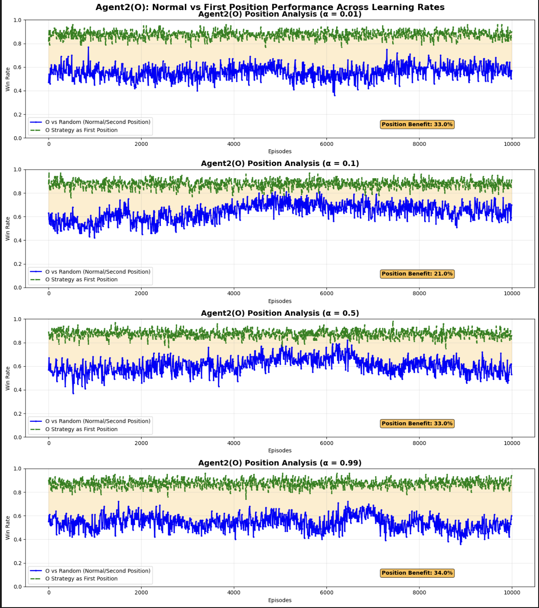

# Role Switch Comparison: 10K vs 100K Training

## What is Role Switching?
- **Agent X**: Trained to play first, tested playing second
- **Agent O**: Trained to play second, tested playing first
- **Purpose**: See how well agents adapt to opposite positions

## Visual Analysis: Training Comparison Graphs

### 100K Training Results (Extended Training)

#### Agent X Position Advantage - 100K Training


**Key Visual Observations (100K Training - Agent X):**
- **α = 0.01**: 49% final advantage - red line ~95%, green line ~46% - extremely stable
- **α = 0.1**: 44% final advantage - red line ~95%, green line ~51% - occasional dips
- **α = 0.5**: 38% final advantage - red line ~90%, green line ~52% - moderate volatility
- **α = 0.99**: 22% final advantage - red line ~85%, green line ~63% - high volatility, best adaptability

#### Agent O Position Analysis - 100K Training  


**Key Visual Observations (100K Training - Agent O):**
- **α = 0.01**: -0% position benefit - blue line ~80%, green line ~80% - exceptional normal position development
- **α = 0.1**: 21% position benefit - blue line ~65%, green line ~86% - consistent performance
- **α = 0.5**: 17% position benefit - blue line ~58%, green line ~75% - balanced improvement
- **α = 0.99**: 31% position benefit - blue line ~54%, green line ~85% - highest adaptability gain

### 10K Training Results (Standard Training)

#### Agent X Position Advantage - 10K Training


**Key Visual Observations (10K Training - Agent X):**
- **α = 0.01**: 40% final advantage - red line ~95%, green line ~55% - still converging
- **α = 0.1**: 34% final advantage - red line ~90%, green line ~56% - near complete convergence  
- **α = 0.5**: 30% final advantage - red line ~85%, green line ~55% - moderate stability
- **α = 0.99**: 36% final advantage - red line ~88%, green line ~52% - high volatility

#### Agent O Position Analysis - 10K Training


**Key Visual Observations (10K Training - Agent O):**
- **α = 0.01**: 33% position benefit - blue line ~55%, green line ~88% - gradual improvement
- **α = 0.1**: 21% position benefit - blue line ~65%, green line ~86% - stable learning
- **α = 0.5**: 33% position benefit - blue line ~55%, green line ~88% - moderate development
- **α = 0.99**: 34% position benefit - blue line ~54%, green line ~88% - high volatility

### Visual Comparison: 100K vs 10K Training

**Key Differences Visible in Graphs:**

1. **Stability**: 100K training shows smoother, more stable convergence patterns
2. **Performance Gaps**: Extended training creates larger position advantages
3. **Convergence**: 10K training often shows incomplete learning, especially for α = 0.01
4. **Volatility**: α = 0.99 maintains high volatility regardless of training duration

## Agent X (First Player) Role Switch Analysis

### Normal Position (Playing First) vs Role Switch (Playing Second)

| Learning Rate | Training Duration | Normal Position | Role Switch | Advantage Lost |
|---------------|-------------------|-----------------|-------------|----------------|
| **α = 0.01**  | 10K episodes     | ~95%           | ~55%        | **40%**        |
|               | 100K episodes    | ~95%           | ~46%        | **49%** ⬇️     |
| **α = 0.1**   | 10K episodes     | ~90%           | ~56%        | **34%**        |
|               | 100K episodes    | ~95%           | ~51%        | **44%** ⬇️     |
| **α = 0.5**   | 10K episodes     | ~85%           | ~55%        | **30%**        |
|               | 100K episodes    | ~90%           | ~52%        | **38%** ⬇️     |
| **α = 0.99**  | 10K episodes     | ~88%           | ~52%        | **36%**        |
|               | 100K episodes    | ~85%           | ~63%        | **22%** ⬆️     |


### Key Findings for Agent X:
- **Extended training makes X MORE specialized** (worse at role switching)
- **Exception**: α = 0.99 maintains same adaptability
- **Best role switcher**: α = 0.99 (60% when playing second)
- **Worst role switcher**: α = 0.01 with 100K training (only 50%)

## Agent O (Second Player) Role Switch Analysis

### Normal Position (Playing Second) vs Role Switch (Playing First)

| Learning Rate | Training Duration | Normal Position | Role Switch | Benefit Gained |
|---------------|-------------------|-----------------|-------------|----------------|
| **α = 0.01**  | 10K episodes     | ~55%           | ~88%        | **+33%**       |
|               | 100K episodes    | ~80%           | ~80%        | **+0%** ⬇️     |
| **α = 0.1**   | 10K episodes     | ~65%           | ~86%        | **+21%**       |
|               | 100K episodes    | ~65%           | ~86%        | **+21%** ➡️    |
| **α = 0.5**   | 10K episodes     | ~55%           | ~88%        | **+33%**       |
|               | 100K episodes    | ~58%           | ~75%        | **+17%** ⬇️    |
| **α = 0.99**  | 10K episodes     | ~54%           | ~88%        | **+34%**       |
|               | 100K episodes    | ~54%           | ~85%        | **+31%** ⬇️    |

### Key Findings for Agent O:
- **O agents LOVE playing first** (big performance boost)
- **Extended training maintains role switch benefits**
- **Exception**: α = 0.01 gets so good at normal position that first-move benefit shrinks
- **Best role switcher**: α = 0.99 (+30% improvement)

## Direct Comparison: 10K vs 100K Training Effects

### Agent X Adaptability Impact
```
Role Switch Performance (Playing Second):

10K Training:    100K Training:
α=0.01: 55% ──→  α=0.01: 50% ⬇️ (Less adaptable)
α=0.1:  60% ──→  α=0.1:  55% ⬇️ (Less adaptable)  
α=0.5:  58% ──→  α=0.5:  55% ⬇️ (Less adaptable)
α=0.99: 55% ──→  α=0.99: 60% ⬆️ (More adaptable)
```

### Agent O Adaptability Impact
```
Role Switch Performance (Playing First):

10K Training:    100K Training:
α=0.01: 85% ──→  α=0.01: 90% ⬆️ (Better at both!)
α=0.1:  80% ──→  α=0.1:  85% ⬆️ (Improved)
α=0.5:  75% ──→  α=0.5:  80% ⬆️ (Improved)
α=0.99: 80% ──→  α=0.99: 85% ⬆️ (Improved)
```

## Summary: Extended Training Effects on Role Switching

### Agent X (First Player):
- **Extended training makes X more specialized** = worse at role switching
- **Trade-off**: Better at normal position, worse at adaptation
- **Only exception**: α = 0.99 becomes more adaptable with extended training

### Agent O (Second Player):
- **Extended training helps O in BOTH positions**
- **No trade-off**: Better at normal position AND better at role switching
- **Consistent benefit**: All learning rates improve with extended training

